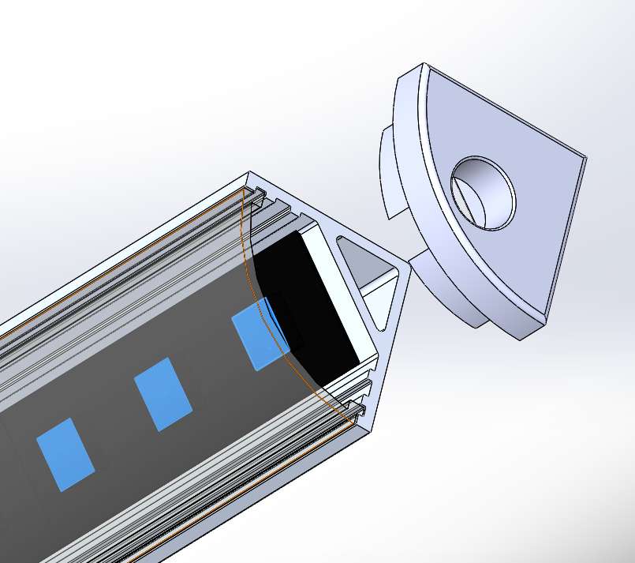
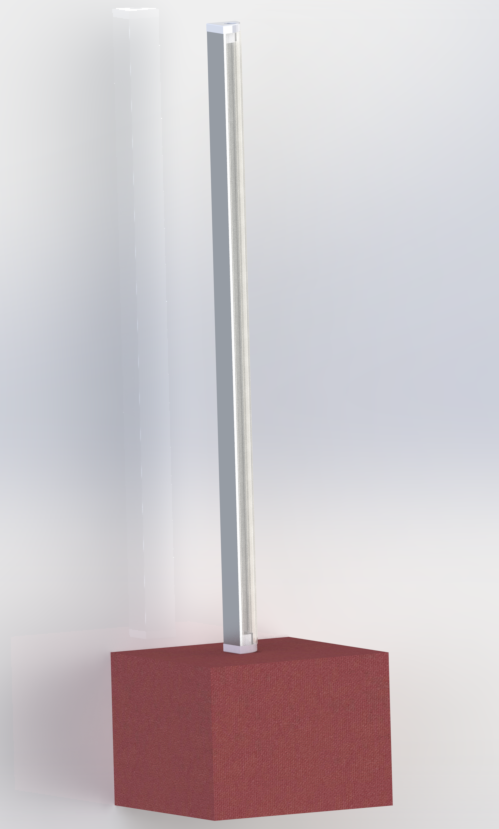

# Desk lamp

This project is about creating a cheap and fun RGB desk lamp. While I was waiting for parts I decided to go ahead and model it in solidworks to see if I could get a sense for the proportions etc.

The models contain parts corresponding to:
- The aluminium V shaped extrusion acting as a channel to hold the LED strip 
- The plastic diffuser cover, that I approximated with translucent nylon
- End caps for the channel
- A rough approximation of an LED strip keeping major dimensions accurate but not modeling the electronics
- A base for the lamp, for which I was considering a wooden box that will let me house any electronics neatly, and for some added (rudimentary) flair, I can wrap the box in coloured fabric

Closeup of the modeled parts:

And final product (modeled, will update with photos if this ever gets built!):
